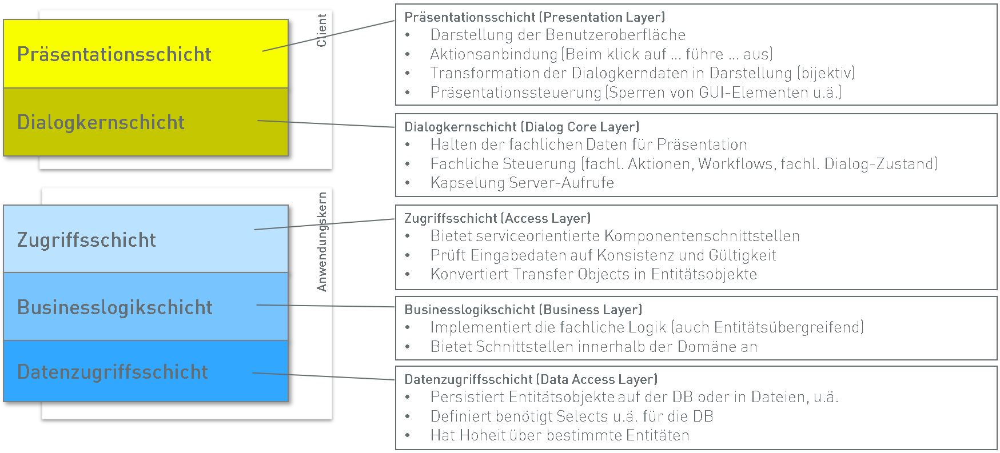

# Tranistion der klassischen zur hybriden Software-Architektur

- Arbeitstitel: ``` ```
- Student: ``` ```
- Matrikelnummer: ``` ```
- Datum der Erstellung: ``` ```
- Betreuender Professor: ``` ```
- Betrieb: 
  ```
  eXXcellent solutions
  consulting & software gmbh
  Industriestraße 48
  70565 Stuttgart
  ```
- Betreuer im Betrieb: ```Andre Lehnert```

## Kontext und Gegenstand der Arbeit

__„Was ist?“ etwa ½ Seite Text über den Startzustand: das Umfeld, den Stand der Wissenschaft und das Problem, das mit der Arbeit zu lösen sein soll.__

Die eXXcellent solutions consultng & software GmbH berät, konzipiert und entwickelt mit ihren Kunden individuelle datengetriebener Softwaresysteme. Der Großteil der Software ist für den internen Betrieb vorgesehen, z.B. für Steuerungs-, Administrations- oder Verwaltungsaufgaben. Typischerweise sind dafür grafische Oberflächen zur Darstellung vieler Informationen notwendig. Hierzu werden Single-Page-Applications (SPA) mit Web-Frameworks, wie Angular, React oder Vue.js verwendet.

Entsprechend einer klassichen 3-Schichten-Architektur, mit einem Client, Server und der Datenhaltung, kommuniziert eine SPA mit mindestens einem Server zustandslos mittels REST. Die Zustände der Anwendung werden stehts beim Client oder in der Datenbank gehalten. Eine solche Lösung setzt daher einen Büroarbeitsplatz mit stetiger Netzwerkverbindung vorraus.

In den Zeiten des mobilen Arbeitens wünscht sich der Kunde zunehmend die permanente Verfügbarkeit der bereitgestellten Funktionen und Informationen. 
Beispielsweise möchte die Geschäftsführung auch in einem Meeting die aktuellen Kennzahlen und Metriken per Tablet abrufem können. Angestellte hingegen wünschen sich die Möglichkeit morgens im Zug bei einer schlechten Netzwerkverbindung Aufträge für den Tag vorzubereiten.

Seit der Vorstellung von Apache Cordova bzw. Adobe PhoneGap im Jahr 2009 sind zahlreiche Frameworks, wie Ionic, ReactNative, Flutter und Electron und schließlich die Web-Standards für Progressive Web Apps entstanden, die eine hybride Nutzung einer einzigen Code-Basis auf verschiedenen Plattformen und Betriebssystemen ermöglichen. Sie erfüllen damit einen Teil der Kundenanforderungen. 

Diese Arbeit widmet sich dem offenen Thema der Offlinefähigkeit und der Übertragbarkeit der jetzigen Software-Architektur hin zu einer "hybriden" Software-Architektur.

## Ziele

__„Was soll?“ etwa ½ Seite abstrakt: Welche Forschungsfragen sollen beantwortet werden? Was soll erreicht werden? Welche wissenschaftlichen Erkenntnisse sollen gewonnen werden?__

Im Rahmen der Arbeit soll eine "hybride" Software-Architektur entwickelt werden. Dazu ist eine Analyse der aktuellen Schichtenarchitektur mit einem Client, Server und einer Datenbank anhand eines Referenz-Projektes notwendig.

Für die Spezifikation dieser neuen Software-Architektur wird eine Überführung der Schichtenarchitektur in eine hexagonale Software-Architektur (auch Zwiebel- oder Clean-Software-Architektur genannt) empfohlen, um die einzelnen Bausteine der ursprünglichen Schichten präsent darzustellen. Dieser Zwischenschritt soll die Lösungsfindung der Offlinefähigkeit unterstützen.

Der Fokus liegt daher auf dem Client und der Erarbeitung einer eigenständigen hexagonalen Teil-Architektur, sodass der Client und der Server jeweils ein "Hexagon" besitzen und miteinander kommunizieren.
Dieses Vorgehen adressiert ein Problem der aktuellen Schichtenarchitektur, bei der der Client unterrepräsentiert bzw. die konkrete Rolle der "Dialogkern-Schicht" unscharf ist, da der Datenzugriff auf den Server inkludiert ist.

Ergibt sich bei der Spezifikation der "hybriden" Software-Architektur der Bedarf eines Bausteins zur Realisierung der Offlinefähigkeit, zum Beispiel in Form eines Proxies, so ist eine Referenzimplementierung vorzunehmen.




## Artefakte

__„Was soll?“ konkret: Stichpunktartig formuliert, welche konkreten Dinge produziert werden sollen. Dazu gehört stets das Thesisdokument, ggf. Programme wie Spezifikationen, Implementationen, Prototypen, Handbücher, oder Videos, Filme.__

- Spezifikation einer Referenzarchitektur für hybride Web-Anwendungen.
  - Eine mögliche Darstellungsform wären zwei Hexagone, für den Client und den Server, und deren Bausteine auf den einzelnen Schichten und den Datenaustausch
- Darstellung des Transitionsprozess der klassischen Software-Architektur des Unternehmens zur kompatiblen und hybriden Software-Architektur.
- Referenzimplementierung eines Bausteins zur Offlinefähigkeit, falls notwendig.
  - Dieser Baustein wäre als Teil der Referenzarchitektur sichtbar

## Aufgaben

__„Wie soll?“: Stichpunktartig einzelne Aufgabenpakete, die vom Start bis zu den Zielen zu bearbeiten sind. Ggf. Vorgehensweisen, Methoden, Lösungsansätze nennen. Ggf. Umfang abschätzen, Reihenfolgen festlegen, Prioritäten setzen.__

Die Aufagen gliedern sich in einen theoretischen und konzeptionellen Teil und einen Teil zu Implementierung eines Prototypen, die die Umsetzbarkeit des Konzeptes zeigt.

- Beschreibung der aktuellen Schichten-Architektur anhand eines Referenz-Projektes
  - Hier bietet sich die Bogenliga-Applikation aus der SWT2-Vorlesung an (steht unter MIT Lizenz auf GitHub bereit)
- Überfühung der Schichten-Architektur in eine hexagonale Architektur mit der Identifikation der einzelnen Bausteine pro "Schicht"
- Heauslösen des Clients in ein eigenes Hexagon
  - An dieser Stelle ist es ggf. notwendig eine zusätzliche Schicht einzuführen, die als äquivalent zur Datenzugriffsschicht des Servers fungiert
- Recherche zu "Best-Practices" der Offlinefähigkeit im Client
  - An dieser Stelle soll nur ein (max. zwei) hybride Web-Frameworks betrachtet werden, z.B. Electron oder PWAs
  - Die eXXcellent stallt vorher eine Anforderungsliste bezüglich Funktionalität, Kompatibilität, Erweiterbarkeit und Technologien (Technologie der Code-Basis) bereit.
- Konzeption einer Lösung zur Offlinefähigkeit
- Referenzimplementierung der Lösung
  - Hier bietet sich die Bogenliga-Applikation aus der SWT2-Vorlesung an (steht unter MIT Lizenz auf GitHub bereit)


## Literatur

__Bücher, Artikel, elektronische Quellen zum Thema__

- ⭐ Formen der Datenpersitierung in Electron, mit Vor- und Nachteilen, sowie der "Bundling" Eigenschaften (DB im Electron Bundle) https://www.techiediaries.com/electron-data-persistence/ 

Zur "hexagonalen" SW-Architektur:
- http://alistair.cockburn.us/Hexagonal+architecture
- https://fideloper.com/hexagonal-architecture
- https://www.infoq.com/news/2014/10/exploring-hexagonal-architecture/
- ⭐ https://blog.cleancoder.com/uncle-bob/2012/08/13/the-clean-architecture.html
- http://www.dossier-andreas.net/software_architecture/layers.html

## Legende

⭐: Leseempfehlung
